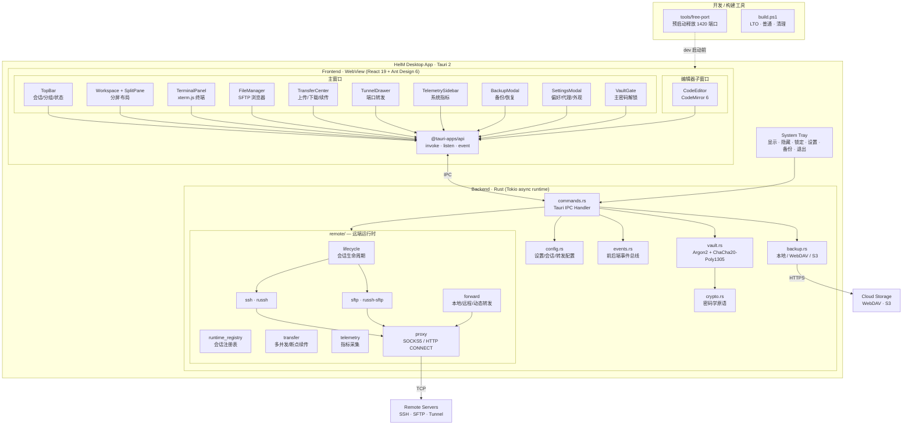

# HelM

> 一个基于 **Tauri 2** + **React 19** + **TypeScript** + **Rust** 构建的跨平台 SSH/SFTP 桌面工作站。
> 单一可执行文件、原生窗口、零云端依赖，把多服务器运维所需的"终端 + 文件 + 转发 + 编辑 + 备份"收拢在一个加密工作区里。

## 功能特性

### 终端与会话

- **多会话并行** —— 同时运行任意数量的 SSH 会话，互不阻塞；会话级独立 Tokio 任务，单会话卡顿不波及其它窗口
- **会话分组** —— 按生产/测试/客户等维度归类，分组保存于加密工作区
- **真终端体验** —— xterm.js 渲染 + addon-fit 自适应；支持 Ctrl+C / Ctrl+Z / 交互式 vim / top 等需要原始终端的程序
- **常用命令面板** —— `quick_commands` 一键发送，按点击次数排序自动凸显高频命令
- **断线重连与心跳** —— 可配置 keepalive 间隔，避免 NAT/防火墙静默掉线

### 文件管理（SFTP）

- **远程文件浏览器** —— 类资源管理器布局，支持双击进入、面包屑路径、隐藏文件切换
- **拖拽上传 / 下载** —— 操作系统拖拽与右键菜单双通道
- **传输中心** —— 多任务并发、单独取消、失败重试，进度可视化
- **断点续传** —— 大文件分块续传，网络抖动后无需从头来过
- **远程编辑** —— 双击远端文件 → 独立 CodeMirror 6 子窗口打开 → 保存自动回写远端

### 端口转发与代理

- **三种转发模式** —— 本地（-L）/ 远程（-R）/ 动态（-D，SOCKS）一站式配置
- **转发可视化** —— 隧道抽屉实时显示绑定端口、目标、状态；启停在 UI 内完成
- **出站代理** —— 全局或会话级 SOCKS5 / HTTP CONNECT，便于跨内网访问

### 系统遥测

- **远端指标侧边栏** —— CPU、内存、网络、磁盘实时折线，无需额外 agent，由后端定时采样推送

### 安全与备份

- **主密码加密工作区** —— 启动需输入主密码解锁；离开座位可一键锁定，需重新解锁
- **零留痕** —— 主密码不持久化、不上送任何远端；密码 / 私钥 / passphrase 仅以 ChaCha20-Poly1305 密文存于本地
- **完整备份** —— 一份备份包含**所有可配置数据**（详见 [备份覆盖范围](#备份覆盖范围)）
- **三通道备份** —— 本地目录 / WebDAV / S3（含 SigV4 签名）任选；可定时自动备份
- **保留策略** —— 按"份数 + 天数"双维度自动清理旧备份
- **加密形态导出** —— 导出的备份本身就是密文，传上云盘也无法离线破解

### 桌面集成

- **系统托盘** —— 关闭按钮最小化到托盘；**双击**托盘图标弹出主窗口（避免误触）
- **托盘菜单** —— 显示 / 隐藏 / 锁定 / 全局设置 / 立即备份 / 退出
- **独立编辑器子窗口** —— 编辑器作为独立 WebView 窗口运行，可与终端并排放置，不抢占主窗口空间
- **本地输入隐私** —— 会话表单禁用浏览器自动填充，主机/账号/端口不会留痕到 WebView 历史

### 备份覆盖范围

`vault.rpvault` 加密容器整体被打包到备份 zip。它涵盖：

| 类别 | 内容 |
|------|------|
| 会话 | 名称、分组、主机、端口、用户名、密码 / 私钥 / passphrase |
| 终端 | 编码、主题、keepalive 间隔 |
| SFTP | 默认路径、是否显示隐藏文件 |
| 单会话代理 | SOCKS5 / HTTP CONNECT 地址端口 |
| 分组 | 自定义分组结构与排序 |
| 端口转发 | 全部已保存的本地 / 远程 / 动态隧道 |
| 全局代理 | `AppSettings.proxy` 出站代理 |
| 常用命令 | `quick_commands` 列表与点击计数 |
| 已信任主机 | known-hosts 指纹列表 |
| 备份配置 | 本地目录、WebDAV / S3 凭据、保留策略、自动备份频率 |
| 历史记录 | `backup_records` 备份日志 |

> 一句话：**所有需要你重新配的东西，都在备份里。** 换机只需安装 + 输入主密码 + 恢复备份即可继续工作。

## 技术架构

### 总览



### 分层职责

| 层 | 模块 | 职责 |
|----|------|------|
| **桌面壳** | `tauri.conf.json` · `lib.rs` | 窗口/托盘生命周期、原生菜单、IPC 注册 |
| **WebView UI** | `src/components/*` | 渲染、状态机、用户交互、表单校验 |
| **IPC 桥** | `@tauri-apps/api` ↔ `commands.rs` | 类型安全的命令调用、事件订阅 |
| **远端运行时** | `src-tauri/src/remote/*` | SSH 协议、SFTP 协议、传输调度、转发监听、遥测采样、代理拨号 |
| **加密工作区** | `vault.rs` · `crypto.rs` | 解密内存模型 / 加密落盘 / 主密码生命周期 |
| **持久化** | `config.rs` | 数据结构定义、序列化兼容（serde + `#[serde(default)]` 向后兼容） |
| **备份引擎** | `backup.rs` | zip 打包、本地写盘、WebDAV PUT、S3 SigV4 上传、保留策略 |
| **事件总线** | `events.rs` | 后端 → 前端的进度/状态/遥测推送 |

### 数据流（一次 SSH 命令的完整路径）

1. 用户在 `TerminalPanel` 输入命令 → xterm onData
2. 前端通过 `@tauri-apps/api` `invoke("terminal_write", ...)`
3. Tauri IPC 路由到 `commands.rs::terminal_write`
4. 命令查 `runtime_registry` 拿到该会话的 `russh::Channel`
5. 写入字节流 → 经 `proxy` 模块 → TCP socket → 远端 sshd
6. 远端 stdout 通过 russh 回传 → `runtime_terminal` 协程读取
7. `events.rs` 用 `app.emit("terminal://data", payload)` 推送
8. 前端 `listen("terminal://data")` 把字节写回 xterm

整个路径**异步、零拷贝、无锁竞争**——每会话一对独立的读写任务，跨会话不互相阻塞。

### 安全模型

```
用户主密码                                ┌─→ 错误尝试 → 拒绝
    │                                     │
    ▼                                     │
Argon2id (内存硬度参数)  ─── 派生密钥 ────┤
    │                                     │
    ▼                                     │
ChaCha20-Poly1305 (AEAD) ◀── salt+nonce ──┘
    │
    ▼
vault.rpvault  (本地)
    │
    ├─→ 解密到内存 → VaultData → 提供给业务模块
    └─→ 不解密直接 zip → 备份包 → 本地 / WebDAV / S3
```

**关键性质：**

- 主密码**只**在内存停留，进程退出立即清零（`zeroize`）
- 派生密钥不离开 Rust 进程，前端也只能拿到解密后的业务数据
- 备份包传上公共云盘**不暴露明文**——攻击者拿到也只是另一份等长密文
- known-hosts 指纹纳入 vault，远端被 MITM 时本地立即觉察

### 进程与窗口模型

- **主进程（Rust）** —— 单实例，托管 Tokio runtime + 所有远端连接
- **主 WebView** —— 工作区 UI，进入主密码后才显示
- **编辑器子 WebView** —— 按需创建，独立窗口可拖到副屏
- **托盘** —— 即使主窗口隐藏，进程依然在线维持连接；双击图标恢复主窗口
- **预启动小工具** —— `tools/free-port` 在 dev 启动前清掉占用 1420 端口的残留 vite 进程，避免端口冲突报错

## 技术栈

| 层级 | 技术 |
|------|------|
| 前端框架 | React 19 · TypeScript 6 · Vite 8 |
| UI 组件 | Ant Design 6 · @ant-design/icons |
| 终端 / 编辑 | xterm.js 6 + addon-fit · CodeMirror 6（JS/TS/Python/SQL/JSON/YAML/CSS/HTML） |
| 桌面运行时 | Tauri 2（tray-icon · plugin-dialog） |
| 后端语言 | Rust 2021（stable） |
| 异步运行时 | Tokio（fs · io-util · net · sync · time） |
| SSH / SFTP | russh 0.60 · russh-sftp 2 |
| 加密 | ChaCha20-Poly1305 · Argon2 · HMAC-SHA256 · zeroize |
| 备份 / 云端 | reqwest（rustls-tls）· zip · WebDAV · AWS S3 SigV4 |
| 测试 | Playwright（E2E） |
| 构建 | Vite 8 · Cargo · `build.ps1`（PowerShell） |

## 开发环境

### 前置要求

- Node.js >= 18
- Rust（stable，需 `cargo`）
- npm（或 pnpm / yarn）
- Windows 用户：建议安装 WebView2 Runtime

### 启动开发服务器

```powershell
# 安装依赖
npm install

# 启动开发模式（热重载）
# 启动前会自动调用 tools/free-port 释放占用 1420 端口的进程
npm run tauri:dev
```

### 生产编译

```powershell
# 使用交互式脚本（推荐）
.\build.ps1

# 或直接调用 Tauri CLI
npm run tauri:build
```

`build.ps1` 提供：
- **LTO 编译** —— 体积更小，编译更慢
- **普通编译** —— 速度快
- **清理缓存** —— 一次清理 cargo target、free-port target、Vite dist/.vite、Playwright test-results

### 端到端测试

```powershell
npm run test:e2e
```

## 项目结构

```
Helm/
├── src/                        # React 前端源码
│   ├── api/                    # Tauri 命令调用封装
│   │   ├── remoteApi.ts        # 远端会话 / SFTP / 转发
│   │   ├── vaultApi.ts         # 加密工作区
│   │   ├── appEvents.ts        # 事件订阅
│   │   └── runtime.ts
│   ├── app/                    # 应用状态、主题、懒加载
│   ├── components/             # UI 组件
│   │   ├── TopBar.tsx
│   │   ├── TerminalPanel.tsx
│   │   ├── FileManager.tsx
│   │   ├── TransferCenter.tsx
│   │   ├── TunnelDrawer.tsx
│   │   ├── TelemetrySidebar.tsx
│   │   ├── BackupModal.tsx
│   │   ├── SettingsModal.tsx
│   │   ├── SessionConfigModal.tsx
│   │   ├── CodeEditor.tsx
│   │   ├── EditorWindowApp.tsx # 编辑器子窗口入口
│   │   ├── VaultGate.tsx
│   │   └── shared/
│   ├── lib/                    # 工具函数（path / format / clipboard …）
│   ├── styles/                 # 模块化 CSS（tokens / layout / modals …）
│   └── types.ts                # 共享类型
├── src-tauri/                  # Rust 后端源码
│   ├── src/
│   │   ├── remote/             # 远端运行时（按职能拆分）
│   │   │   ├── lifecycle.rs
│   │   │   ├── runtime_registry.rs
│   │   │   ├── runtime_connection.rs
│   │   │   ├── runtime_terminal.rs
│   │   │   ├── runtime_sftp.rs
│   │   │   ├── runtime_transfer.rs
│   │   │   ├── runtime_forward.rs
│   │   │   ├── runtime_telemetry.rs
│   │   │   ├── ssh.rs / sftp.rs
│   │   │   ├── transfer.rs / telemetry.rs
│   │   │   └── proxy.rs
│   │   ├── commands.rs         # Tauri IPC 命令
│   │   ├── vault.rs            # 加密工作区
│   │   ├── crypto.rs           # 密码学原语
│   │   ├── backup.rs           # 本地 / WebDAV / S3 备份
│   │   ├── config.rs           # 配置/设置
│   │   ├── events.rs           # 事件总线
│   │   ├── errors.rs
│   │   └── lib.rs / main.rs
│   ├── capabilities/           # Tauri 权限清单
│   ├── icons/                  # 应用图标
│   └── tauri.conf.json
├── tools/free-port/            # 启动前清理 1420 端口的小工具
├── tests/                      # Playwright E2E
├── build.ps1                   # Windows 交互式编译脚本
├── playwright.config.ts
└── package.json
```

## License

MIT
